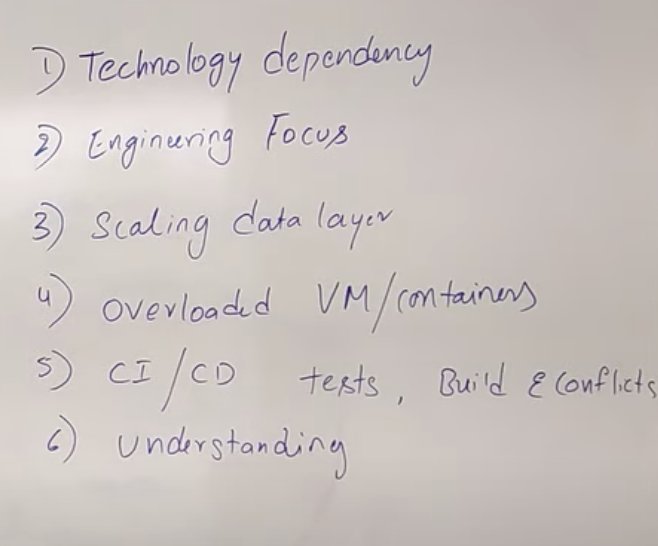
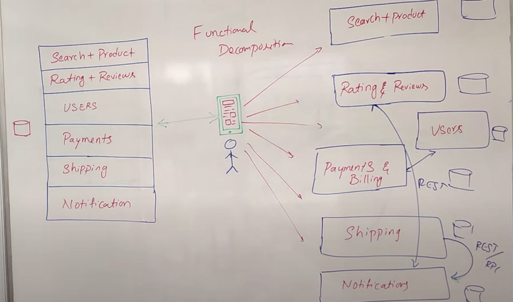
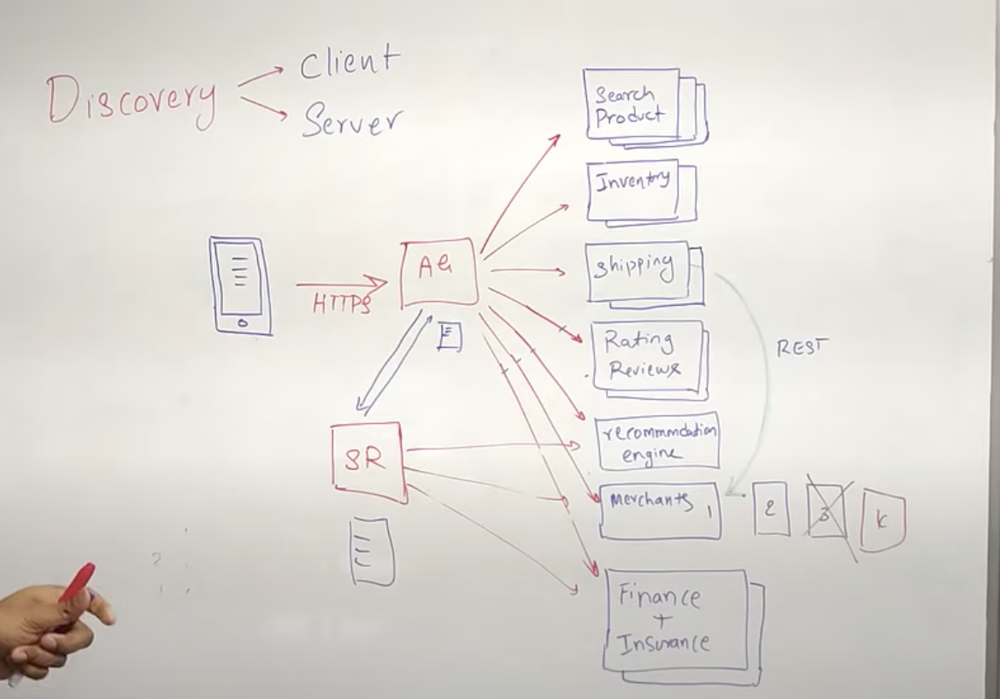
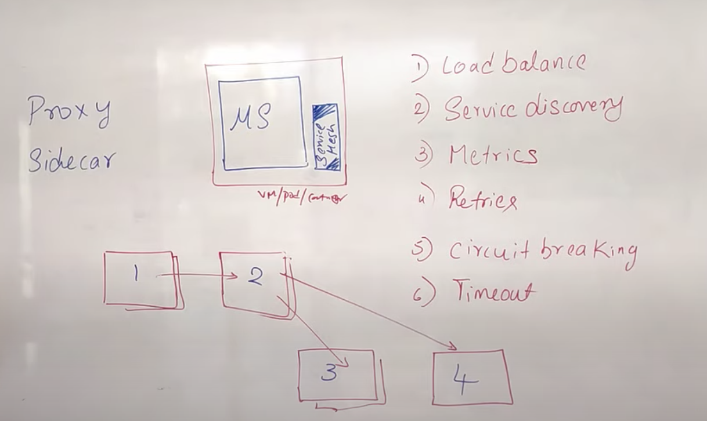

# Micro services

Disadvantages of Monolitic architecture

-> Function decomposition is the technique to break the existing app into small applications
ex: eCommerce

## API Gateway

## service registry

it is a DB or API stores all Micro services instances IP address, if either client or API gate way want to talk to any service, it get details from service registry

## Service Discovery:
    accessing info in registry
    

## Communication b/w micro service
- synchronous
- Async

## Sync
through http or grpc calling one after another micro service.
-   advantages
    -   Easy
    -   Realtime response
-   Disadvantages
    -   Service availablity
    -   Response time
## Async intercommunication pattern
-   Saga pattern

## Circuit breaking

## Service mesh

