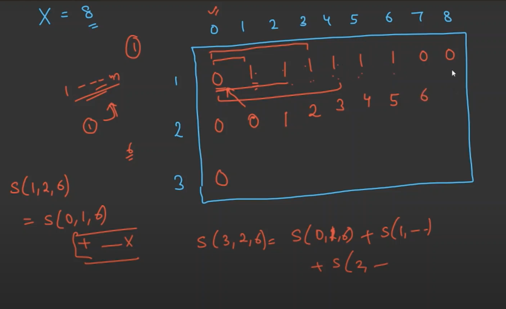

/*

Types of DP:(refer below link)
https://leetcode.com/discuss/general-discussion/458695/dynamic-programming-patterns

https://leetcode.com/list/55ac4kuc - (Min - max path to target)
https://leetcode.com/list/55ajm50i - (distinct ways)
https://leetcode.com/list/55aj8s16 - (merging intervals)
https://leetcode.com/list/55afh7m7 - (DP on strings)
https://leetcode.com/list/55af7bu7 - (decision making)

 -- >DP means recursion without repetetion.

****  Top down memoization
 -- recursive approach

** Bottom-up memoization
 --> iterative approach

 ** Counting subsets of k
  -> if we use recursive it takes 2^n time comlexity
  -> to reduce time complexity we need to use memoization.
  ->

** Count unique paths
    given m , n array chose different path from start poisition to end position
    and every move sould be either right or down only
    -> to go from start to end it has to go m-1 rights and n-1 downs.
    -> total steps (m-1) + (n-1) = m+n-2
    -> so if we choose m-1 or n-1 from m+n-2 combination we got solution.

    so we need to find C = ((m+n-2),(n-1))

    DP is 2 types
    1) Memoization(top-down)
    2) tabulation(bottom-up)
    we generally prefer bottom-up tablulation.

    **** Any DP problem is a graph problem on the dependency grapy DAG(
        Directed Asyclick graph)

        https://leetcode.com/problems/fibonacci-number/ --- done
        https://leetcode.com/problems/climbing-stairs/
https://leetcode.com/problems/subsets/
https://leetcode.com/problems/subsets-ii/
https://leetcode.com/problems/edit-distance/
https://leetcode.com/problems/knight-dialer/
https://leetcode.com/problems/house-robber/
https://leetcode.com/problems/house-robber-ii/
https://leetcode.com/problems/house-robber-iii/
https://leetcode.com/problems/partition-equal-subset-sum/
https://leetcode.com/problems/word-break/
https://leetcode.com/problems/word-break-ii/
https://leetcode.com/problems/coin-change/
https://leetcode.com/problems/coin-change-2/

## Counting permutations
https://leetcode.com/problems/climbing-stairs/
https://leetcode.com/problems/n-th-tribonacci-number/
https://leetcode.com/problems/domino-and-tromino-tiling/
https://leetcode.com/problems/pascals-triangle/
https://leetcode.com/problems/unique-paths/
https://leetcode.com/problems/unique-paths-ii/
https://leetcode.com/problems/dungeon-game/
## Optimize permutations
https://leetcode.com/problems/minimum-path-sum/
https://leetcode.com/problems/min-cost-climbing-stairs/
https://leetcode.com/problems/triangle/
https://leetcode.com/problems/minimum-cost-for-tickets/

279: https://leetcode.com/problems/perfect-squares/
1048 https://leetcode.com/problems/longest-string-chain/
343 https://leetcode.com/problems/integer-break/
221: https://leetcode.com/problems/maximal-square/
1143: https://leetcode.com/problems/longest-common-subsequence/

https://leetcode.com/problems/shortest-common-supersequence/
1155: https://leetcode.com/problems/number-of-dice-rolls-with-target-sum/

https://leetcode.com/problems/interleaving-string/
https://www.educative.io/courses/grokking-dynamic-programming-patterns-for-coding-interviews/RM1BDv71V60