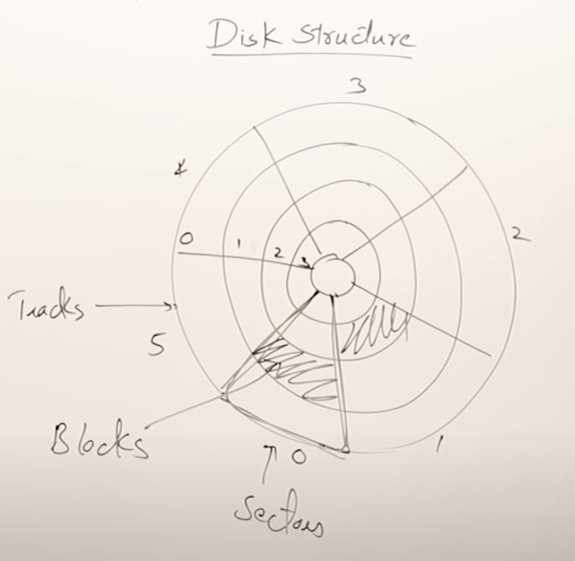
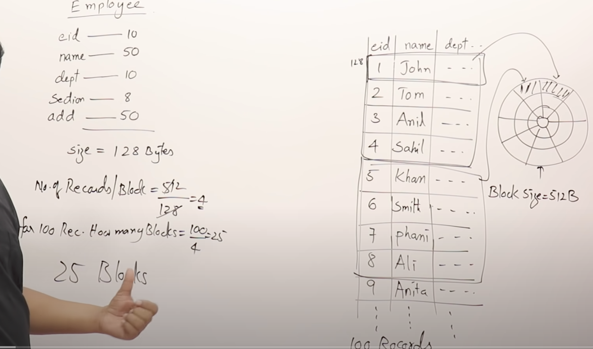
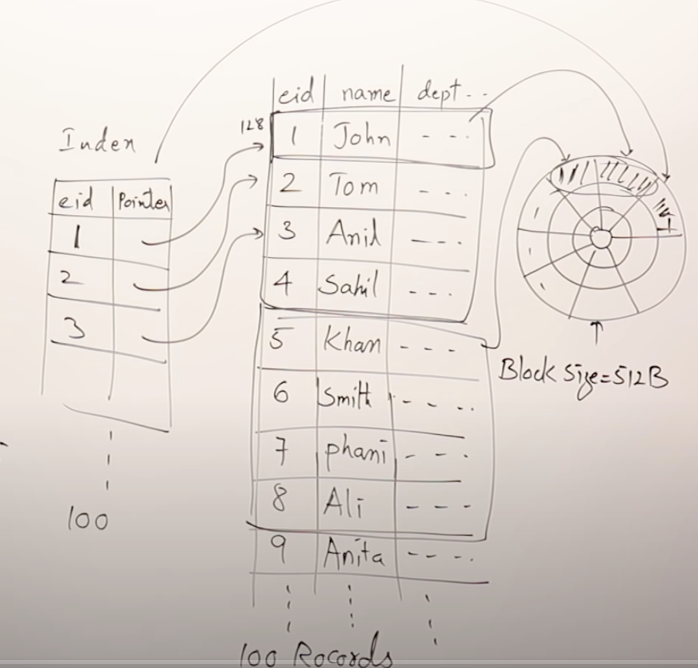
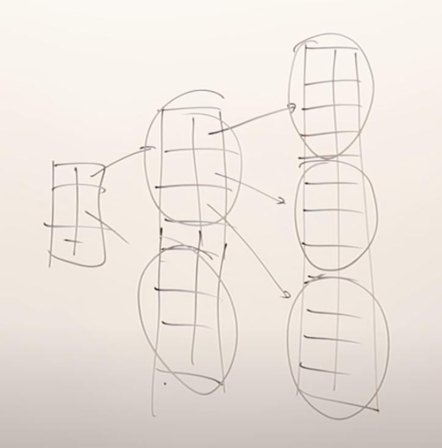
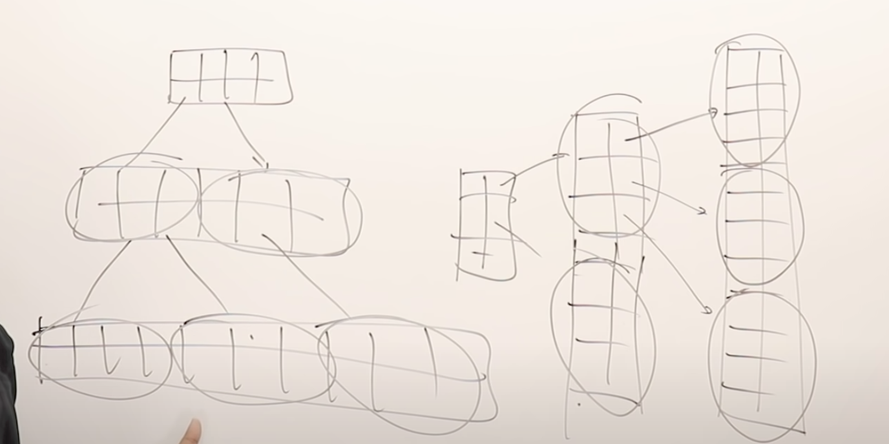
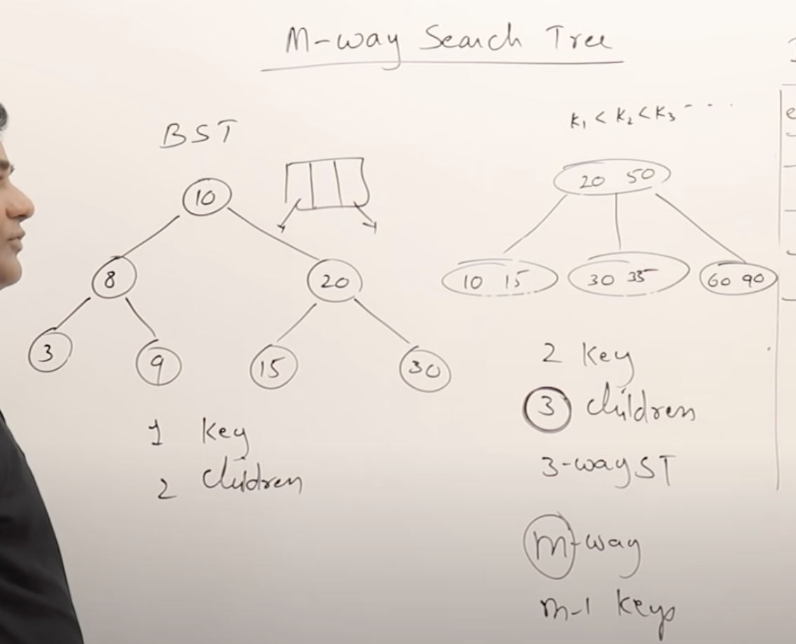
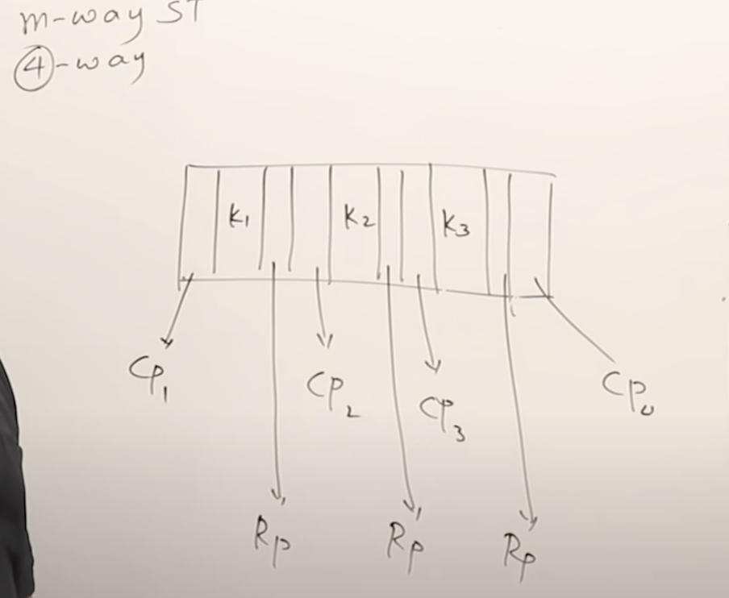
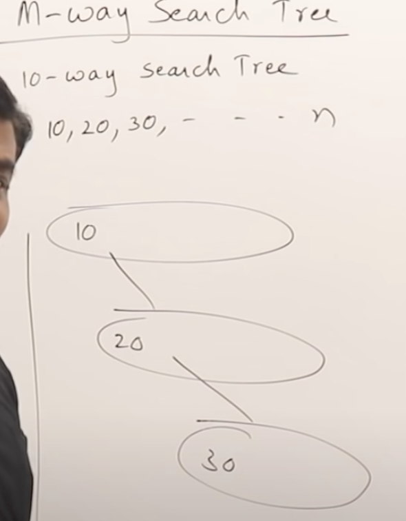
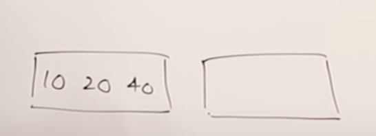
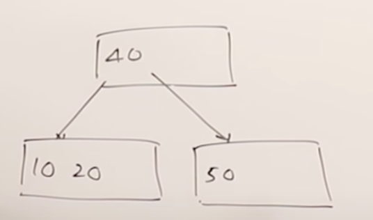

# B trees and B+ trees

## Disk structure

-   it is divided into tracks and sectors
-   portion exists between track and sector is called blocks
-   Block address = (trackNo, sectorNo)
-   block size varies on the manufacture ex: 512
-   offset is the position on a block

Data can be prcessed only from Main memory. so if anything present in disk
first it has to moved to MM and viceversa

-   Organizing data on MM is called datastructure
- organizing data on disk is called DBMS

## How data is organized on disk

-   For any record we need to search for 25 blocks
- To avoid that we have to do indexing table

- we create a table and store each index and their record offset values
- Problem here is we store that index table also in disk only.
- So assume index has 2 field empId and pointer
- empId = 10 bytes, pointer 6 byts
- for 100 entires 100 * 16 = 1600 byts
- each block takes only 512 byts
- it request 3.2 blocks to sotore again this index data
- again we get same search issue, but now instead of searching 25 blocks of actual data, we can search 3.2 blocks of index + 1 block of data(to get record)
it reduced from 25 to 5 blocks.

- Again to reduce search issues if index also grows, we can have again another index to store index values for each range, that is called multi level index

- If we change rotate this structure it look like a tree

## M-way search tree
- These are useful for range queries.
- In a binary search tree each node can have only 2 children
- In a M-way search tree each node can have M children

Ex:
- 4 way search tree
-  It will have 3 keys and 4 children
- CP = child pointer
- RP = record pointer

Problem with M-way search trees

-   There are no guidelines to create M-way search tree.
- no specific way to insert data
- So somtimes it leads to linear search patterns

To solve above issues B trees are introduced.

## B trees
-   Root can have minimum 2 children
-   For any M-way search tree, first the node m/2(ceil) children must be filled.
- All leaf nodes must be at same level
- creation process is bottom up

example:
-   create a 4-way search tree.
- values, 10, 20 , 40 , 50.
- we can have 3 keys

- so first fill 10, 20, 40 in one node
- split 50 to another.
- This is bottom- up approach, so one node need to be moved to up.
- so 40 is moved to up

## B+ trees
- it is similar to B trees
- only leaf nodes has index pointer
- where as in B tree every node has index pointer
- rest concepts are same

## Reference
https://www.youtube.com/watch?v=aZjYr87r1b8