# OAuth

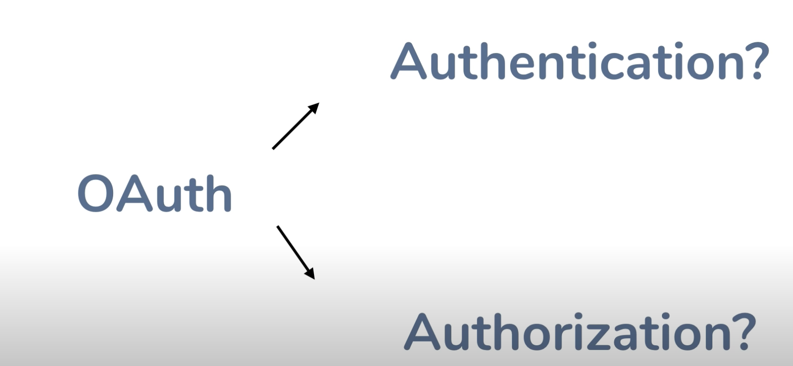
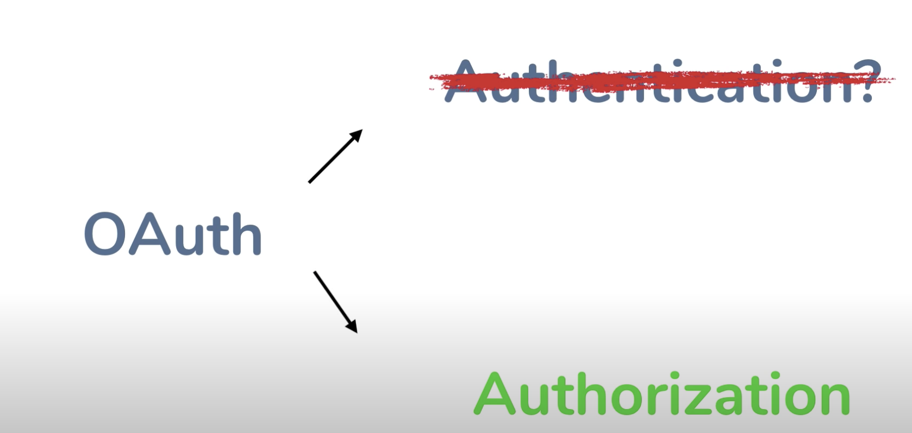
oAuth is created for Authentication purpose
- it is created to authorize service to service. Later we are using for authentication as well

## example of what is OAuth
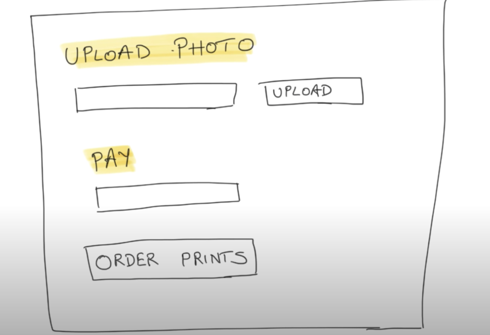

- Assume you have photoprint APP.
- User has to upload their images
- images are part of cloud

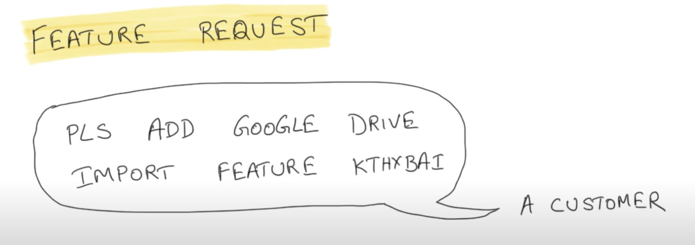
- user want to upload images directly from cloud
- they don't want to download and upload to your app
- need to implement upload fom googlde drive feature

- To access google photos app need users userid/password, but user can't trust app.
- They just want to print few photos permission.

what is solution ?
- solution is oAuth
- user provides deligated access to google docs.

## OAuth flow

- Google asks user to provide permission to APp.
- User login to google account and provides permission

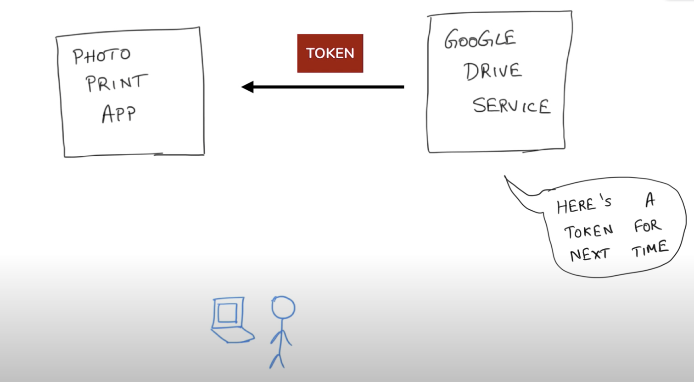
- once user gives permission to google
- Goole issues token to App.
- So in the next call App calls Google with that token
- But it has only limited permissions
- Token used for OAuth is JWT.

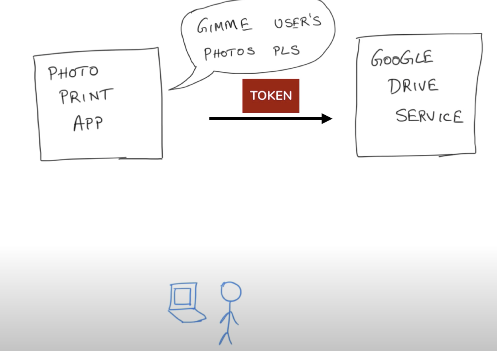

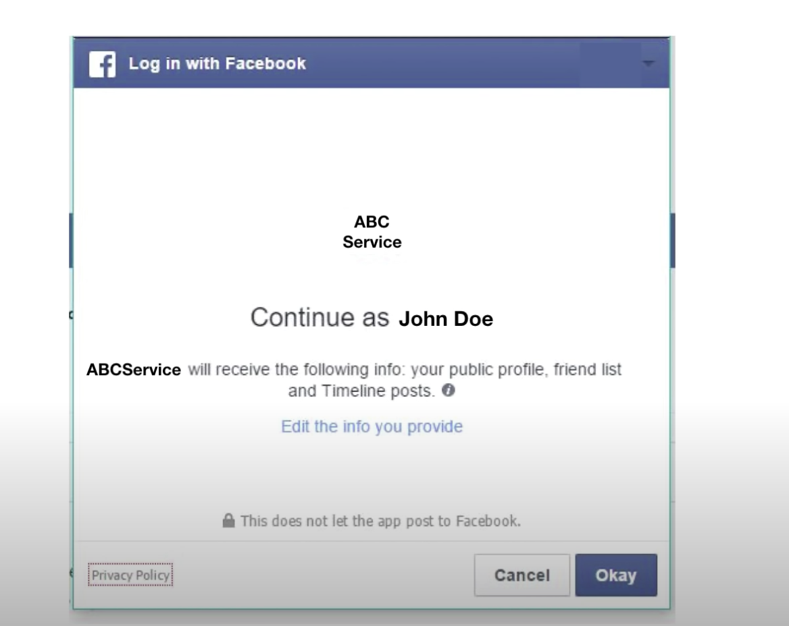

## OAuth terminology
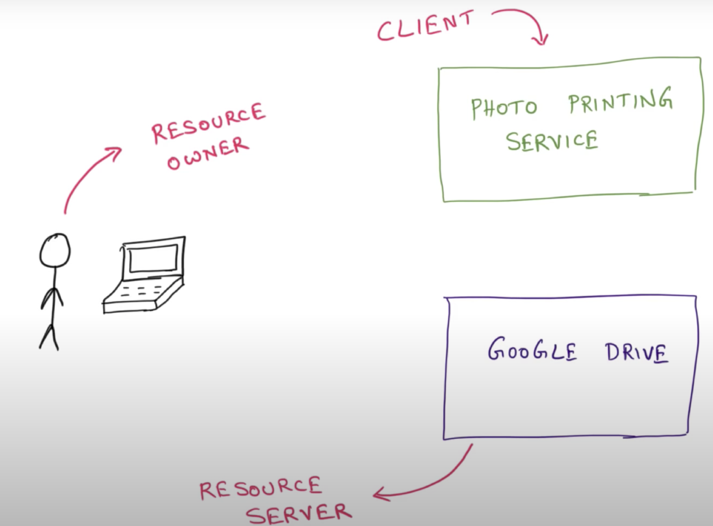

who has to maintain the OAuth burder?

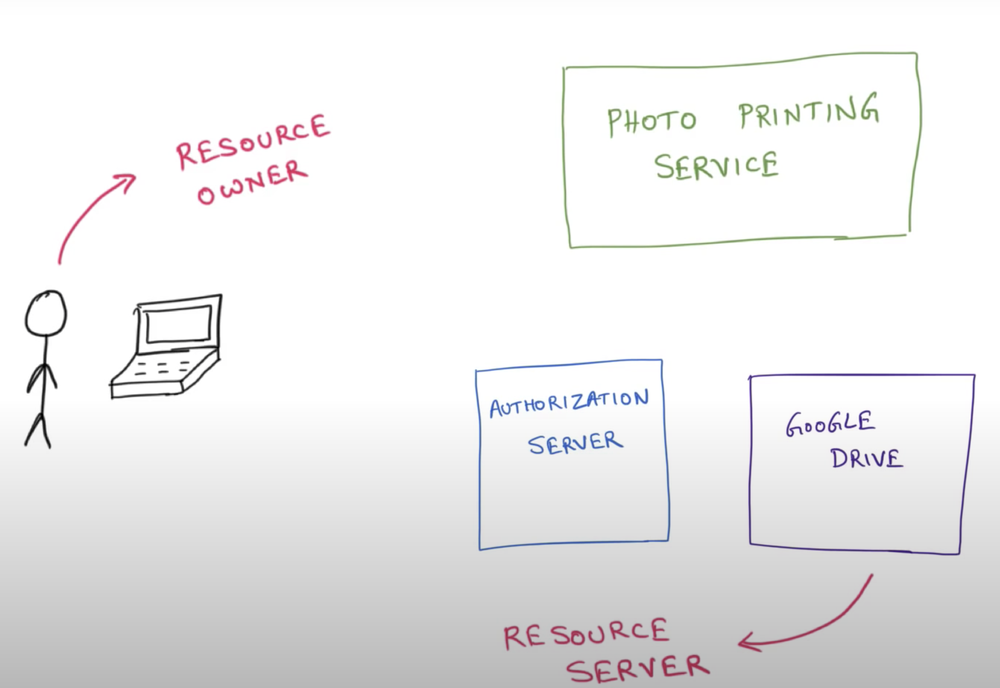
- Resource server has to maintain it
- the OAuth service is either a separate service that resource server maintains or with the same service.

# OAuth different flows

## 1.Authorization code flow
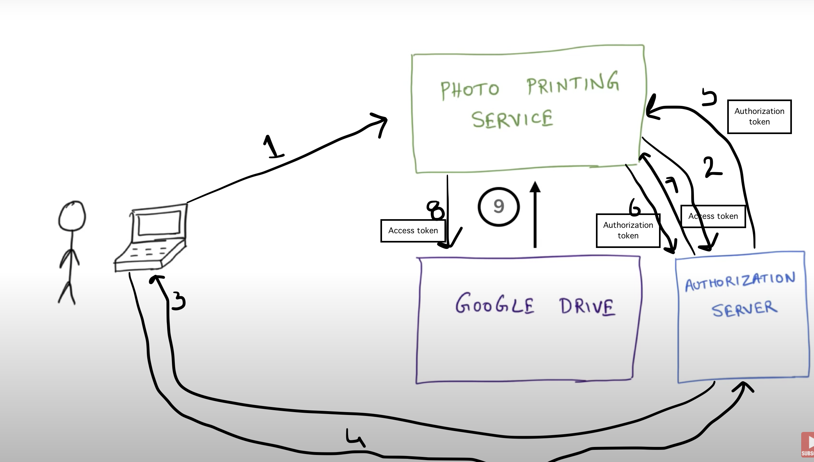

## 2. Implicit flow
all steps are same except calling  authorization server two times 
1) Authorization token
2) Access token, 
it calls only one time and first time itself auth services gives access token

## client credential flow
when client is well trusted(confidential clients)
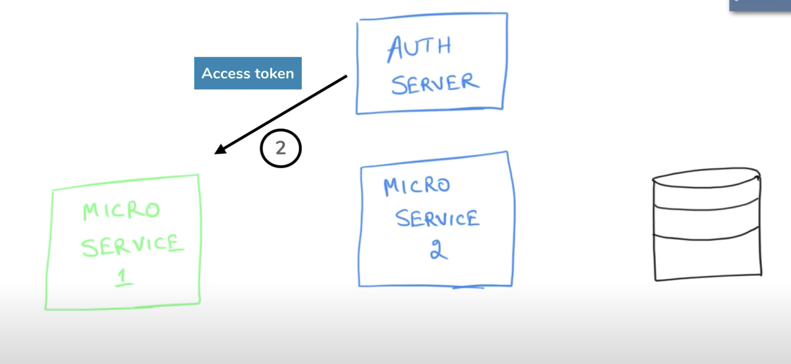

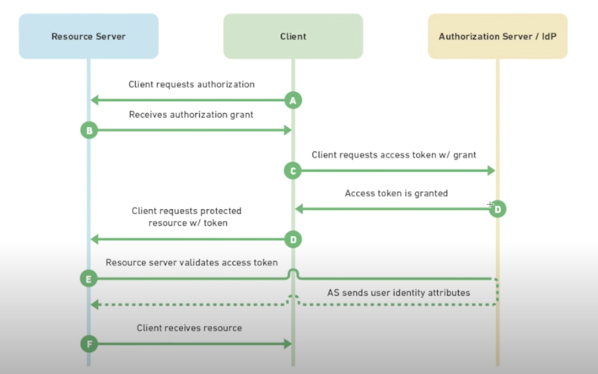

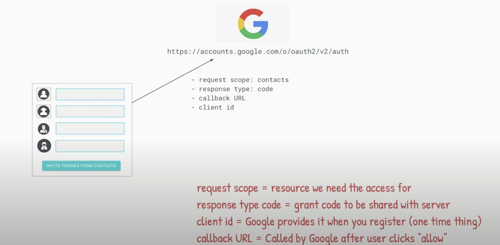

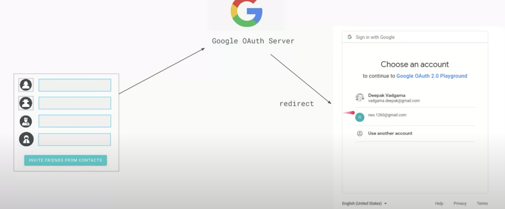

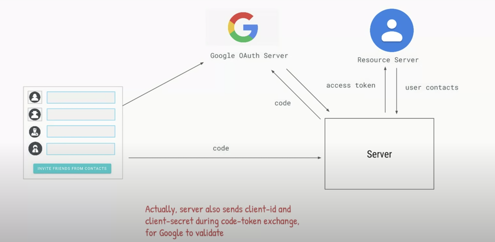

# OpenId connect
openId connect is a thin layer built on top of OAuth 2.0 for login purpose

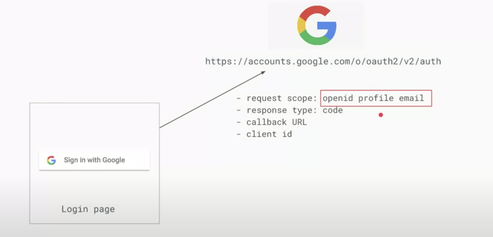
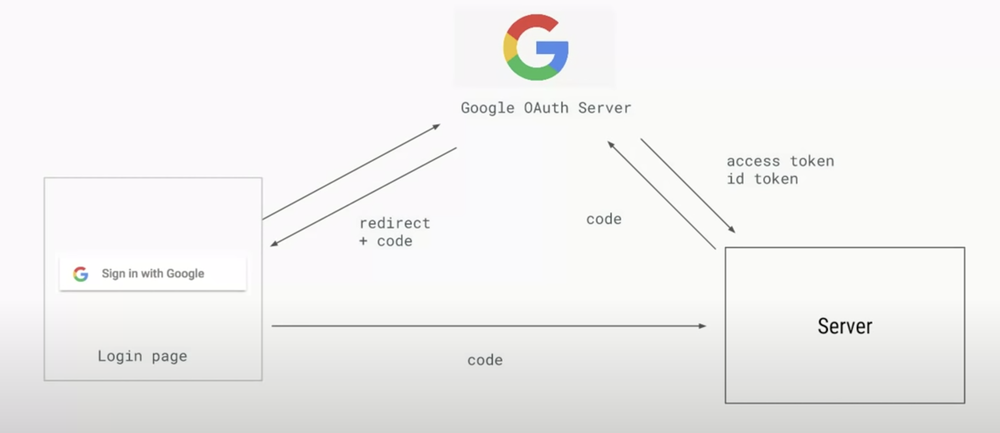

id parm in the above slide is JWT that contains users info as well.
