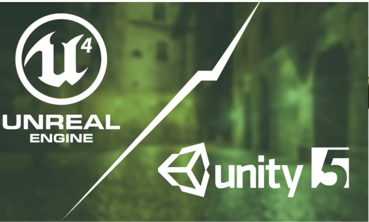

# Online gaming 

- online gamaing has mainfunctionality game loop
- it has 3 differnt functionalities
    - check input
    - update game state
    - render screen
- games are developed using unity or unreal engine frameworks

- Different types of games
    - Stratgic games
    - Slow turn games
    - First person games