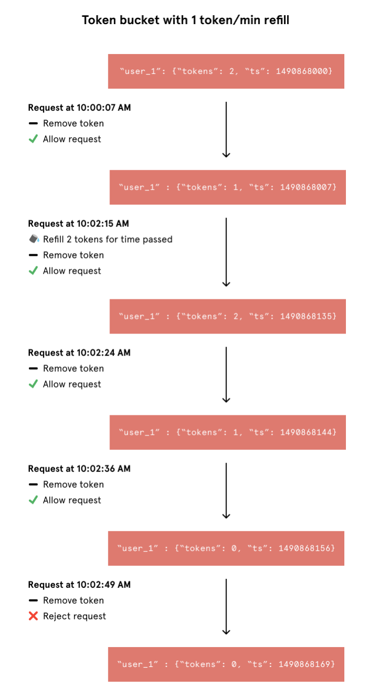
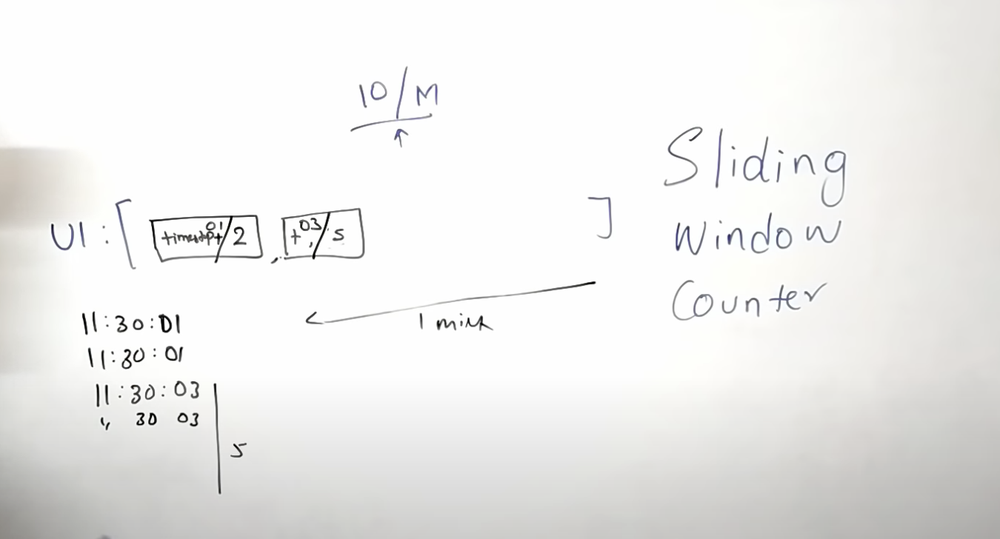
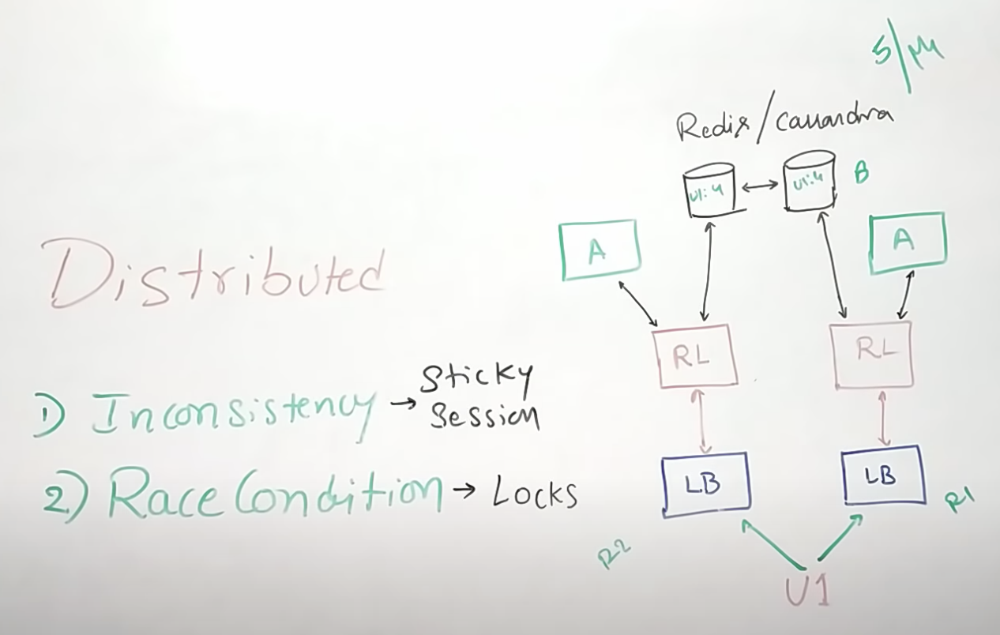
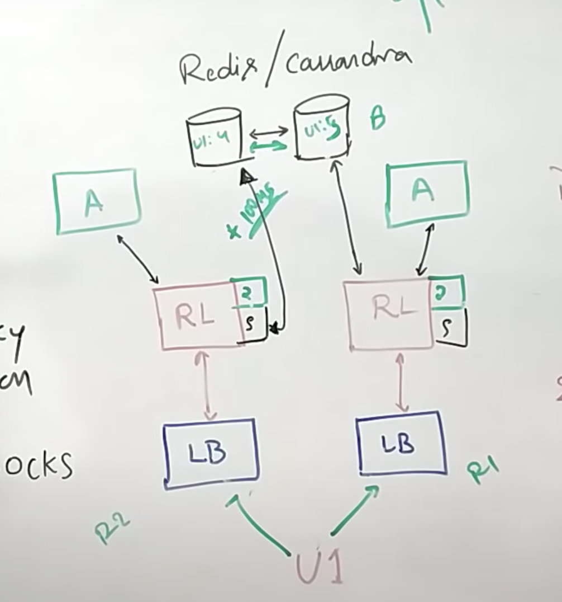

# Rate limit

Rate Limiting is an important concept in designing systems. Rate limiting enables you to limit the number of requests on your servers. In short, you can control the load you can have on a server.

## Differeent types of rate limits
-  user - How many users we are going to allow per min/sec
-  concurrent - How many parallel users are allowed
-  location/ID - in case of anu event in any location, we can rate limit in other locations

##  Different Algorithms
- Token Bucket
- Leacky Bucket
- Sliding logs

## 1. Token Bucket(Throttle pattern)
it is two parts
- Fetch token - check if tokens are available
- Update token - decrement the token after servong the request.

if the time difference b/w calls is more than one min, token get filled.
if token are completed in 1min, then the othere req, won't be served

## 2. Leaky Bucket(queae pattern)

## 2.A Fixed window counter
here time we keep fixed 1 min windows, like 10:00 and 10:01 etc
-> each window we keep soeme target req to be served. ex 10 req.
-> if the count increases more than this we drop those req.

Problem with this appropach:

 if 20 req come at 10 hr 59 sec, then we will serve first 10 before it crosses 1 min, and next 10 fall in next window so we serve those as well. so in less thatn 5 sec we process 20 req, it may cause server to go down.

 ## 3. Sliding logs

 rate limiting involves tracking a time stamped log for each consumer’s request. These logs are usually stored in a hash set or table that is sorted by time. Logs with timestamps beyond a threshold are discarded. When a new request comes in, we calculate the sum of logs to determine the request rate. If the request would exceed the threshold rate, then it is held.

 Advantage:
 - Doesn't suffer from boundary conditions of fixed window
 - Also this is tracked for each consumer don't have stampede effect.

 DisAdvantages:
 - Expensive to store the req,
 - Expensive compute

 ## sliding window
 keeping both timestamp + counter in the hasahmap

## Distributed rate limiting

solution : 1
Relaxing rate limit
- it means ex if 100 req is limit, some time it may go to 1 or 2 extra, so we have to consider that is fine

solution: 2
Local memory + sync service

 ## Reference:

 https://www.youtube.com/watch?v=mhUQe4BKZXs&t=3s

 https://konghq.com/blog/how-to-design-a-scalable-rate-limiting-algorithm/#:~:text=Sliding%20Log%20rate%20limiting%20involves,to%20determine%20the%20request%20rate.